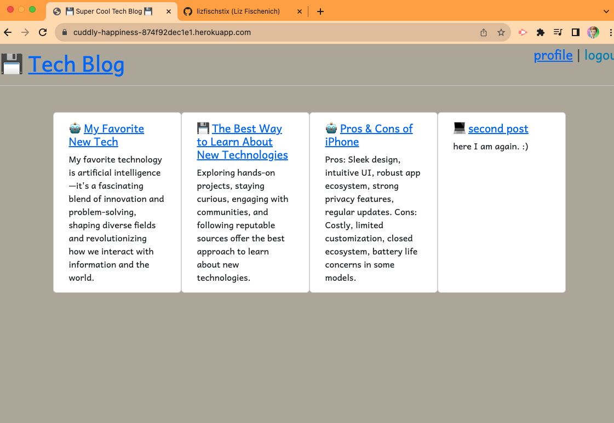

# Liz Makes a Tech Blog
  
  ## Description: 
  This project includes a wordpress style blog web app where users can create and delete their own blog post and where other useres can comment on their posts once logged in.
  ## Table of Contents:
  * [demo](##demo)
  * [installation](#installation)
  * [credits](#credits)  
  * [License](#license)

  ## Demo:
  Check out a walkthrough video demo [HERE](https://watch.screencastify.com/v/YUVQifPthaybwHQFxe7e).
  ## Installation: 
  the code repositoy can be accessed at [github.com/lizfischstix/cuddly-happiness](https://github.com/lizfischstix/cuddly-happiness) where the user will install npm dependancies once cloned, log into mysql,  plant the seed data and start the express server to view on their local machine. The deployed project can be accessed [HERE](https://cuddly-happiness-874f92dec1e1.herokuapp.com/).   
  ## Credits: 
  code from NU full stack bootcamp project 14 was repurposed for the base of this project with much (appreciated) help from instructional staff andand turotorss.  Bootstrap cdn and google fonts were used for css styling.
  ## Contact:
  [@lizfischstix](https://github.com/lizfischstix)
  ## License:
    This project is licensed under the MIT license

  

    